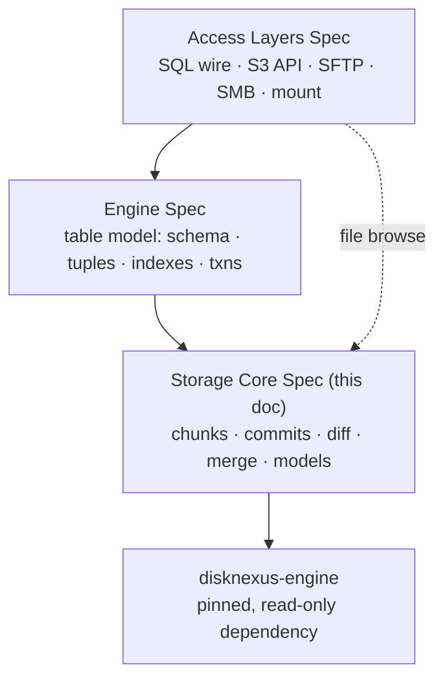

# Versioned DB — Storage Core Spec

Sep 22, 2026 · @Someone

## Overview

The storage core versions any kind of data. It stores content-addressed chunks on pluggable backends, records commits, branches and tags, and diffs and merges by delegating meaning to data-model plugins. It knows nothing about tables, SQL or protocols.

The three specs stack like this:



- **This doc** owns backends, chunkers, the object model, the commit graph, generic diff and merge, and the model-plugin interface.
- **The Engine Spec** becomes the first data-model plugin: tables. Its L0–L3 sections move here; its L4 stays there.
- **disknexus-engine** supplies proven parts (chunking, hashing, packs, index, crypto) that we import, never edit.

**Goals**

- One commit can hold a table, a folder of files, and a JSON document side by side.
- Diffs cost time proportional to the change, not the data size, for every model.
- Backends: local disk, several mount points, and S3, all behind one interface.
- Every change arrives behind a test that failed first, to the standard in disknexus-engine's `docs/TESTING.md`.

**Non-goals for v1:** multi-node consensus, zero-copy import of existing S3 objects (lakeFS-style), and any change to disknexus-engine.

## Reusing disknexus-engine without modifying it

We import `github.com/SmithOperatingSolutions/disknexus-engine` as an ordinary Go dependency. No commits, forks, patches or pull requests go to that repo from this project.

**Dependency rules**

1. **Pinned version.** `go.mod` pins an exact tagged release (currently v0.2.9 or later), verified by `go.sum`. Upgrades are deliberate PRs that re-run the full suite plus the compatibility tests below.
2. **Imported only in `core/dnx`.** One adapter package is the only place allowed to import disknexus-engine; `depguard` fails the build on any other import. Everything else codes against our own interfaces, so a disknexus release can never leak into the object model.
3. **No `replace` directives** and no vendored edits. If we need behavior disknexus doesn't have, we wrap it or write our own package beside it.
4. **Copy only as a last resort.** If a needed function is unexported, we write our own implementation from the published format docs in `docs/`, keeping the Apache 2.0 `NOTICE` attribution. We do not copy-and-modify its source.
5. **Pinned-behavior tests.** A `core/dnx/compat` suite checks the facts we depend on, such as "chunk identity is SHA-256 of the chunk bytes" and "the same input produces the same boundaries." A disknexus upgrade that changes any of them fails CI before it can reach the core.

**What we take, and what we leave**

- **Take:** pure, well-bounded pieces with no backup-product assumptions: `core/chunker`, `core/hasher`, `core/crypto`, and the pack framing and compression in `core/store`.
- **Leave:** `core/pipeline`, `core/manifest`, `core/prune`, `core/retention`, and the volume/VSS/BMR packages. They encode backup semantics (volumes, generations, retention) that don't fit a commit graph. Our commit graph and GC are new.
- **Wrap:** `core/store` and `core/index` are usable, but their repo layout, file permissions and plaintext mode don't meet our security rules. Our wrappers own repo creation, permissions and encryption policy (see Security).

## Package map

Every core package is marked **reuse** (call the disknexus package through `core/dnx`), **wrap** (reuse inside our own policy layer), or **new** (ours). Reviewed against disknexus-engine at commit `b2c02f1` (Sep 12, 2026).

| Our package | Job | Status | disknexus-engine source | Notes |
| --- | --- | --- | --- | --- |
| `core/dnx` | The only importer of disknexus | new | — | Adapters plus the compat suite |
| `core/blob` | `BlobStore` port: put/get immutable objects, root compare-and-swap | new | — | disknexus has no root CAS; remote I/O there is caller hooks |
| `core/blob/local`, `multivol`, `s3` | Backends | new | — | S3 lives in the disknexus product, not the engine |
| `core/pack` | Pack many chunks into one object, compress, encrypt, index offsets | wrap or new (decide in M0) | `core/store` | Its `ChunkStore` is tied to a local dir and numbered packs; reuse its framing only if it fits a hash-addressed layout |
| `core/cdc` | Byte-stream chunking for files and blobs | reuse | `core/chunker` | Buzhash with FastCDC-style normalized masks; deterministic, single-threaded |
| `core/hash` | Chunk identity | reuse | `core/hasher` | SHA-256 identity; xxHash only as a filter hint |
| `core/dedup` | "Do we already have this chunk?" | wrap | `core/index` | Bloom filter + sorted hash index; we add our own key and permission policy |
| `core/seal` | Encryption and key wrapping | wrap | `core/crypto` | AES-256-GCM with domain tags, Argon2, X25519 wrapping; we add our own tags and forbid the no-tag calls |
| `core/prolly` | Ordered-map chunking for keyed data | new | — | See Chunkers |
| `core/object` | Typed objects and the namespace tree | new | — | Replaces backup manifests |
| `core/vcs` | Commits, branches, tags, working sets, merge base | new | — | disknexus manifests only carry a parent-backup link |
| `core/merge` | Generic three-way merge driver | new | — | Calls model plugins for meaning |
| `core/gc` | Reachability-based garbage collection | new | — | disknexus retention/prune is generation-based |
| `core/model` | Model-plugin registry and interface | new | — | See Data-model plugins |

Roughly a quarter of the core comes from disknexus, and it's the hardest-won quarter: chunk geometry, hashing, and crypto are where subtle bugs cost the most.

## Blob backends

A backend stores immutable objects by name and swaps one mutable root pointer atomically. That is the entire contract; chunks, packs and commits are built on top.

```go
type BlobStore interface {
    Put(ctx context.Context, name string, r io.Reader, size int64) error // fails if name exists
    Get(ctx context.Context, name string, off, n int64) (io.ReadCloser, error) // range read
    Stat(ctx context.Context, name string) (BlobInfo, error)
    List(ctx context.Context, prefix, after string, limit int) ([]BlobInfo, error)
    Delete(ctx context.Context, name string) error // GC role only
    Root(ctx context.Context) (Root, error)         // value + version token
    SwapRoot(ctx context.Context, expected Version, next []byte) (Version, error) // ErrRootConflict
}
```

| Backend | Package | Put-if-absent | Root swap | Writers | Scales by |
| --- | --- | --- | --- | --- | --- |
| Local disk | `core/blob/local` | `O_CREAT\|O_EXCL` | lock file + temp + `fsync` + rename | one process | bigger disk |
| Several mount points | `core/blob/multivol` | per volume, placed by rendezvous hash | on the primary volume | one process | adding volumes |
| S3 and compatibles | `core/blob/s3` | `If-None-Match: *` | `If-Match: <ETag>` on the root object | many | effectively unbounded |
| Memory | `core/blob/mem` | map | mutex | one process | tests only |

The detailed rules from the Engine Spec's "L0 storage backends" section (filesystem allowlist, volume markers, S3 retry and startup probe, IAM scoping) move here unchanged.

**First failing tests to write**

- [ ] A shared `blob/contract` suite runs against every backend: put, get, range get, list paging, put-existing refused, root swap, stale swap refused.
- [ ] 50 concurrent root swappers on `s3` (MinIO in CI): exactly one wins per round, none lost.
- [ ] kill -9 during `SwapRoot` on `local` and `multivol`, 1,000 times: reopened root is old or new, never torn.
- [ ] `s3` startup probe refuses an endpoint that ignores `If-Match`.

## Chunkers

The core has two chunkers because data comes in two shapes. Both produce SHA-256-addressed chunks that land in the same packs and dedup against each other.

| Chunker | For | Source | Boundary rule |
| --- | --- | --- | --- |
| `core/cdc` | Byte streams: files, images, Parquet, model weights, any opaque blob | reuse disknexus `core/chunker` | Buzhash rolling hash with FastCDC-style hard/easy masks around min, average and max size |
| `core/prolly` | Keyed, ordered data: table rows, JSON object fields, directory listings | new | Split after an entry when a hash of its key falls under a size-dependent threshold (Engine Spec L1 rules move here) |

**Rules**

- **Geometry is repo-wide and immutable.** CDC sizes and mask, and prolly node targets, are fixed at repo init and recorded in the signed repo config. Changing them would break dedup, so it's refused.
- **No normalizers in the core.** disknexus can hash *normalized* bytes while storing the originals. The core always hashes exactly the bytes it stores, so any reader can re-verify a chunk. A file model can normalize before handing bytes to the core if it needs to.
- **Large values inside keyed data** (a 50 MB cell, a big JSON string) go through `cdc` and are referenced by hash from the prolly node.
- **Determinism is tested, not assumed:** the same input and geometry always give the same boundaries and the same root hash.

**First failing tests to write**

- [ ] `cdc` via `core/dnx`: golden boundaries for a fixed 64 MiB corpus match a checked-in list (guards against a disknexus upgrade changing geometry).
- [ ] `cdc`: inserting 1 byte near the start of a 1 GiB file changes at most 3 chunks.
- [ ] `cdc`: stored bytes re-hash to their chunk id on every read path.
- [ ] `prolly`: all Engine Spec L1 tests (determinism, history independence, bounded diff cost) move here unchanged.
- [ ] A prolly value over the inline limit is stored via `cdc` and reads back byte-identical.

## Object model and commit graph

Each commit points at one **namespace tree**: a prolly map from path to typed object. A table, a folder of files and a JSON document are just different objects in that tree, so they branch, diff and merge together.

| Object | Stored as | Holds |
| --- | --- | --- |
| `Namespace` | prolly map | path → `ObjectRef` |
| `ObjectRef` | fixed binary record | model id (uint16), model format version, root hash, size, flags |
| `Blob` | CDC chunk list | an opaque byte stream (file content) |
| `Commit` | encoded record | parents (0–2), namespace root, author, UTC time, message, height |
| `Tag` | encoded record | target commit, tagger, message |
| `Refs` | prolly map (the backend root) | `heads/<b>`, `tags/<t>`, `work/<b>` → hash |
| `WorkingSet` | encoded record | working and staged namespace roots, merge state, conflicts |

**Rules**

- The Engine Spec's L2 rules move here unchanged: every ref update goes through `SwapRoot`, the branch-name allowlist, height for fast merge-base, `Log` limits, and author taken from the `Principal`.
- **Paths** follow an allowlist grammar: UTF-8, `/`-separated, each segment 1–255 bytes, no `.` or `..`, no control characters, max depth 64. Invalid paths are rejected at write.
- **Model id** says which plugin owns an object. The id must be in the compiled-in registry; an unknown id makes the object unreadable (`ErrUnknownModel`), never guessed at.
- **Generic diff** walks two namespace trees, skipping equal subtree hashes, and reports added, removed and changed paths. For a changed path with the same model id, it asks that model for a detailed diff.
- **GC** marks everything reachable from refs, working sets and a configurable grace window (default 7 days), then deletes unreachable packs through the GC role only.

**First failing tests to write**

- [ ] One commit holding a table, a blob and a JSON document round-trips all three.
- [ ] Changing one file in a 100,000-path namespace reads fewer than 200 nodes to diff.
- [ ] An object with an unregistered model id returns `ErrUnknownModel`; nothing is decoded.
- [ ] Invalid paths (`a/../b`, empty segment, 256-byte segment, NUL) are rejected (property test).
- [ ] GC never deletes a chunk reachable from any ref or working set (property test over random histories), and does delete unreachable ones after the grace window.

## Data-model plugins

A model gives an object's bytes meaning: how to write it, diff it and merge it. The core finds what changed; the model decides whether two changes can combine.

```go
type Model interface {
    ID() ModelID            // stable, registered at compile time
    FormatVersion() uint16  // bumped on any encoding change
    Validate(ctx context.Context, root Hash, r ChunkReader) error
    Diff(ctx context.Context, from, to Hash, r ChunkReader) (DiffIter, error)
    Merge(ctx context.Context, base, ours, theirs Hash, rw ChunkReadWriter) (MergeResult, error)
}

type MergeResult struct {
    Root      Hash        // merged object, valid only if len(Conflicts) == 0
    Conflicts []Conflict  // model-specific locations, stored in the working set
}
```

**Registration:** explicit, with no globals and no `init()` side effects. The host builds a registry and passes it to `Open`: `reg, err := model.NewRegistry(blob.Model{}, tree.Model{}, table.Model{})`. The registry is immutable once built, and a duplicate id returns an error, so a clash fails at startup.

| Model | Id | Package | Diff unit | Merge rule | Target |
| --- | --- | --- | --- | --- | --- |
| Blob (opaque file) | 1 | `model/blob` | whole object; byte ranges via CDC chunks | conflict if both sides changed | v1 |
| Directory tree | 2 | `model/tree` | path entries plus file mode and mtime | per entry; delete-vs-edit conflicts | v1 |
| Table | 3 | `model/table` (Engine Spec L4) | row, then cell | per cell; schema first | v1 |
| JSON document | 4 | `model/json` (built outside the core as `model/document`) | JSON path | per field; array edits conflict unless keyed | v1.1 |
| Time series | 5 | `model/series` | time range | append-only union; overlapping edits conflict | later |
| Key-value | 6 | `model/kv` (outside the core) | key | per key, by the value's kind: bytes conflict, counters add, sets union, hashes per field, sorted sets per member, sequences by position | v1.1 |

**Rules**

- The generic `core/merge` driver handles the easy cases itself (only one side changed, both sides identical) and calls `Model.Merge` only when both sides changed the same path.
- A model that returns an error aborts the whole merge; the working set is unchanged.
- Every model ships a `model/contract` suite run: round-trip, determinism, diff-matches-edits, merge(b, o, o) == o, and a fuzzed decoder.

**First failing tests to write**

- [ ] NewRegistry with two models sharing an id returns an error and no registry.
- [ ] A repo opened with a registry that lacks a model its objects use refuses those objects with ErrUnknownModel.
- [ ] `model/blob`: both sides edit one file → exactly one conflict; one side edits → clean merge.
- [ ] `model/tree`: branch A deletes `x/`, branch B edits `x/y` → delete-vs-edit conflict on `x/y`.
- [ ] Every registered model passes `model/contract`.

## Security requirements

The core assumes a backend can be read or tampered with, so it encrypts and verifies everything itself. Because we can't change disknexus, our wrappers close its gaps rather than patching them.

**Gaps in disknexus-engine and how the core closes them**

| disknexus behavior (at `b2c02f1`) | Risk | How the core closes it |
| --- | --- | --- |
| `InitRepo` creates dirs `0755` and `config.json` `0644` (32 similar sites in `core`) | Other local users can read repo metadata | We never call `InitRepo`. `core/blob/local` creates every dir `0700` and file `0600`, and a test fails on any wider mode |
| `EncryptNone` is a valid repo mode | Plaintext data at rest | Encryption is mandatory in our repo config; opening a repo without a key fails. No plaintext mode exists |
| `Encrypt`/`Decrypt` accept no domain tag | Ciphertext could be replayed across contexts | `core/seal` exposes only tagged calls, with our own tags (`vdb/chunk/v1`, `vdb/commit/v1`, `vdb/refs/v1`, ...) |
| Chunk identity can be a hash of normalized bytes | Stored bytes can't be verified by hash alone | The core never enables normalizers; identity is always SHA-256 of the stored plaintext bytes |
| Random 96-bit GCM nonces, one master key | Past about 2^32 encryptions per key, nonce reuse becomes a real risk | Per-pack data keys derived from the master key (HKDF-SHA-256 with a random 256-bit pack salt), so no single key nears the limit |
| Managed-mode index encryption not verified in this review | Chunk hashes and layout could leak | The core encrypts its own index files; a test asserts no plaintext hash appears on disk |

**Core requirements**

- AES-256-GCM for all data and metadata at rest; master keys from a KMS or Argon2id passphrase wrapping; keys never stored beside data.
- SHA-256 verified on every read, from every backend, cached or not.
- Hand-written, bounds-checked decoders for every on-disk structure; fuzzed nightly. No reflection-based or generic deserialization of stored bytes.
- Model ids resolved only against the compiled-in registry; unknown ids fail closed.
- Every public call takes a `Principal`; the core passes it to a default-deny `Authorizer` per branch and per path prefix.
- Hard limits: object size, path depth, conflicts per merge, `Log` length, list page size. None unlimited.
- Supply chain: disknexus pinned by version and `go.sum`; `govulncheck` on every push covers it too.
- CI adds what disknexus CI lacks: `staticcheck`, `golangci-lint` (warnings as errors), `govulncheck`, and the fail-first `red-check` job.

## Milestones, first tickets, and open questions

The storage core is built first; the table model (Engine Spec) and the access layers start once C3 freezes the model interface. Estimates assume 3–4 engineers.

| Milestone | Delivers | Exit criteria | Estimate |
| --- | --- | --- | --- |
| C0 Foundations | New repo, CI with red-check and lint gates, `core/dnx` with the pinned dependency and compat suite | Compat suite green against the pinned disknexus tag | 1–2 weeks |
| C1 Blobs and chunks | `core/blob` (mem, local, multivol, s3), `core/cdc`, `core/hash`, `core/seal`, `core/pack`, `core/dedup` | Blob contract suite green on all backends; crash harness passes | 4–6 weeks |
| C2 Keyed data | `core/prolly` | Determinism and bounded-diff properties hold on 1M entries | 3–4 weeks |
| C3 History and models | `core/object`, `core/vcs`, `core/merge`, `core/model`, `model/blob`, `model/tree` | A folder of files branches, diffs and merges end to end; model interface frozen | 5–7 weeks |
| C4 GC and hardening | `core/gc`, per-pack keys, index encryption, fuzzers | GC safety property holds; security table fully verified | 3–4 weeks |

**First tickets**

- [ ] Create the storage-core repo with `core/`, `model/` layout and `depguard` rules (disknexus importable only from `core/dnx`).
- [ ] Pin disknexus-engine to its latest tag; add `govulncheck` and `go mod verify` to CI.
- [ ] `core/dnx/compat`: golden CDC boundaries for a fixed corpus, SHA-256 identity with no normalizer, and a GCM round-trip with a domain tag, all written red first.
- [ ] `core/blob` port and the `blob/contract` suite (all red), then `blob/mem` to green.
- [ ] Spike: can disknexus `core/store` pack framing serve hash-addressed packs? Record the reuse-or-rewrite decision for `core/pack`.
- [ ] Update the Engine Spec so L0–L3 point here and the table model becomes a plugin.

**Open questions**

- [ ] Repo and module name for the storage core.
- [ ] Can we rely on a disknexus release cadence and tagging policy, or do we pin and upgrade only on security fixes?
- [ ] Which model is second after files: JSON documents or tables?
- [ ] Do we need zero-copy import of existing S3 objects (lakeFS-style) in v1.x?
